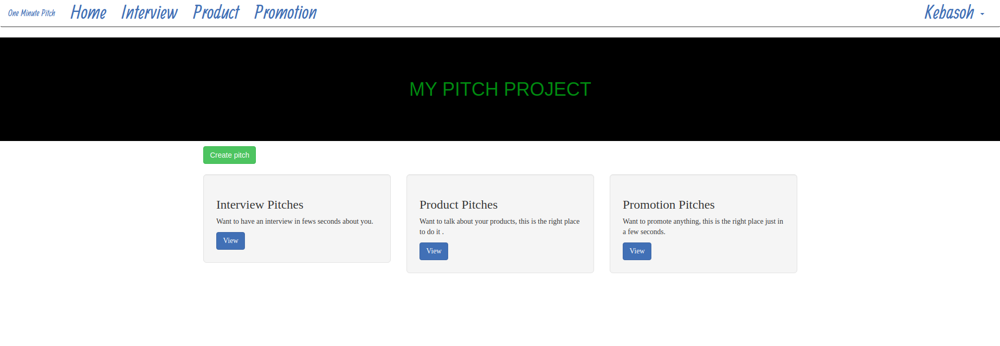

## PROJECT NAME

- ONE MINUTE PITCH

## AUTHOR'S NAME

- KEBASO STEVE ONGATI 

## PROJECT DESCRIPTION

- This is a web based pitching application that displays a list of piches posted by a user who has loged in,they will be able to click on a    certain pitch to delte it or update it | Behavior| input | output | | -------- | -------- | -------- | | Display pitches | On page load |    Show various pitches posted by different users is displayed | | Display pitches from other users | Click on a pitch | Redirect to a page     where you can access the pitch you have just clicked on | 

## Getting started

- Clone repository to your computer
- Install python
- Create virtual environment
- Go to Newsapi and get Api

## BDD

  
  
- In our pitch you can create an account and then sign up.You can also post pitches that you want whether its the product,interview or the     promotion part.

## TECHNOLOGY USED

- You Require to install

* Python3.6

* Flask

* Pip

* Virtual environment

## PROJECT GITHUB LIVE LINK

- https://stevepitch.herokuapp.com/

## Contacts info

* Email:ongatikebaso@gamil.com
* Github: kebasoh

## LICENSE

- This software license under MIT License
- Copyright (c) KEBASO STEVE ONGATI 2020
